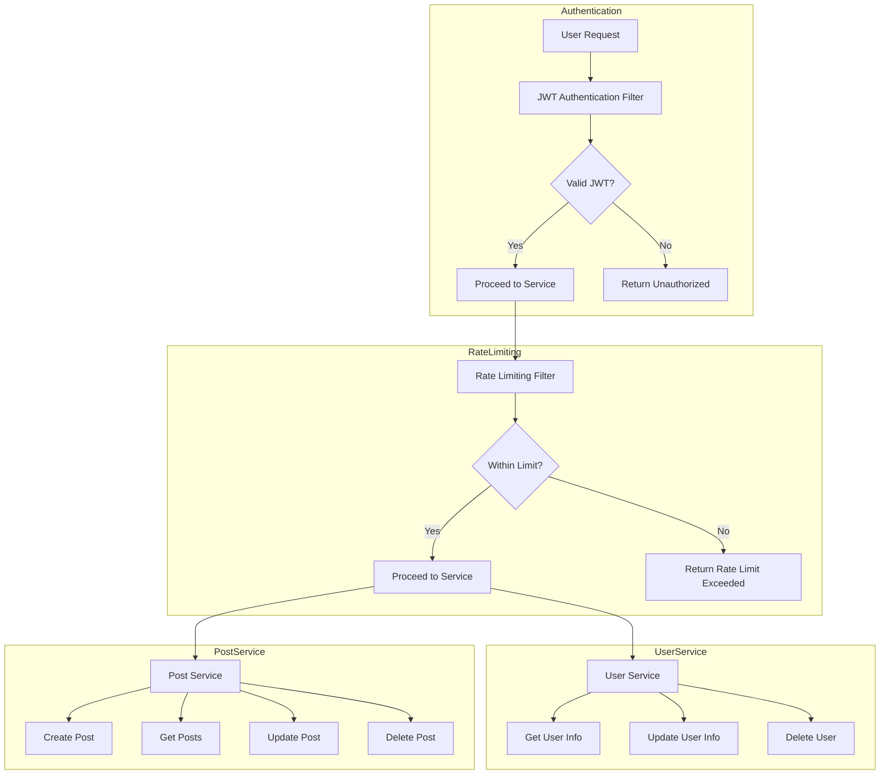

```mermaid
flowchart TD
subgraph Authentication
A[User Request] --> B[JWT Authentication Filter]
B --> C{Valid JWT?}
C -- Yes --> D[Proceed to Service]
C -- No --> E[Return Unauthorized]
end

    subgraph RateLimiting
        D --> F[Rate Limiting Filter]
        F --> G{Within Limit?}
        G -- Yes --> H[Proceed to Service]
        G -- No --> I[Return Rate Limit Exceeded]
    end

    subgraph UserService
        H --> J[User Service]
        J --> K[Get User Info]
        J --> L[Update User Info]
        J --> M[Delete User]
    end

    subgraph PostService
        H --> N[Post Service]
        N --> O[Create Post]
        N --> P[Get Posts]
        N --> Q[Update Post]
        N --> R[Delete Post]
    end
```