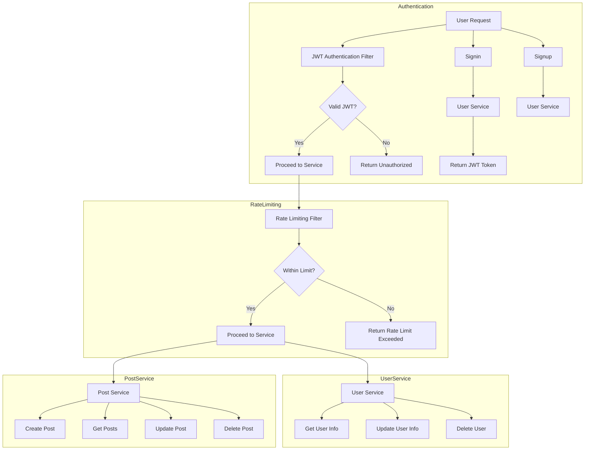

```mermaid
flowchart TD
    subgraph Authentication
        A[User Request] --> B[JWT Authentication Filter]
        B --> C{Valid JWT?}
        C -- Yes --> D[Proceed to Service]
        C -- No --> E[Return Unauthorized]
        A --> F[Signup]
        A --> G[Signin]
        G --> H[User Service]
        H --> I[Return JWT Token]
        F --> J[User Service]
    end

    subgraph RateLimiting
        D --> K[Rate Limiting Filter]
        K --> L{Within Limit?}
        L -- Yes --> M[Proceed to Service]
        L -- No --> N[Return Rate Limit Exceeded]
    end

    subgraph UserService
        M --> O[User Service]
        O --> P[Get User Info]
        O --> Q[Update User Info]
        O --> R[Delete User]
    end

    subgraph PostService
        M --> S[Post Service]
        S --> T[Create Post]
        S --> U[Get Posts]
        S --> V[Update Post]
        S --> W[Delete Post]
    end
```